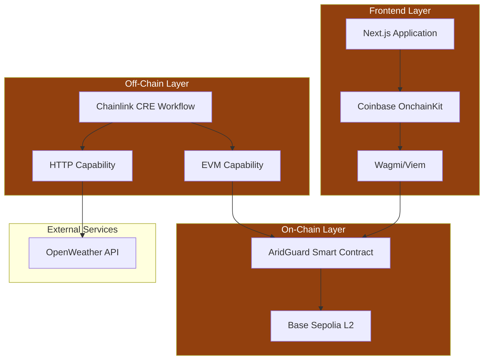

## System Architecture

AridGuard is built on a three-layer architecture that combines on-chain smart contracts, off-chain compute, and a modern web frontend:



## Layer Breakdown

### 1. Frontend Layer

The user-facing web application built with:

- **Next.js 14**: React framework with App Router
- **Coinbase OnchainKit**: Wallet integration and identity components
- **Wagmi**: React hooks for Ethereum interactions
- **Viem**: TypeScript Ethereum library
- **TailwindCSS**: Utility-first styling

**Responsibilities:**
- Wallet connection and authentication
- Policy purchase interface
- Real-time event monitoring
- Transaction status tracking
- User notifications

**Technology Stack:**
```json
{
  "next": "14.x",
  "@coinbase/onchainkit": "latest",
  "wagmi": "2.x",
  "viem": "2.x",
  "tailwindcss": "3.x"
}
```

### 2. On-Chain Layer (Base Sepolia)

The blockchain settlement layer deployed on Base Sepolia:

**Smart Contract:** `AridGuard.sol`

```solidity
contract AridGuard is Ownable {
    address public creAddress;          // Authorized CRE executor
    mapping(bytes32 => Policy) public policies;  // Policy storage
    bytes32[] public activePolicyIds;   // Active policy tracking
    
    struct Policy {
        address farmer;
        int256 lat;
        int256 long;
        uint256 premiumPaid;
        bool isActive;
    }
}
```

**Responsibilities:**
- Policy registration and storage
- Premium collection and custody
- Payout execution (CRE-triggered)
- Access control and security
- Event emission for off-chain indexing

**Deployed Contract:**
- **Address:** `0x23d747751abF06b68539f0684abe21E2A76901fc`
- **Network:** Base Sepolia (Chain ID: 84532)
- **Verification:** [View on BaseScan](https://sepolia.basescan.org/address/0x23d747751abF06b68539f0684abe21E2A76901fc)

### 3. Off-Chain Layer (Chainlink CRE)

The serverless compute environment that bridges real-world data to blockchain:

**CRE Workflow:** `main.ts`

```typescript
const onCronTrigger = (runtime: Runtime<Config>) => {
  // 1. Fetch weather data
  const rainfall = fetchWeatherData();
  
  // 2. Evaluate threshold
  if (rainfall < threshold) {
    // 3. Execute payout
    executePayoutOnChain();
  }
};
```

**Capabilities Used:**

<CardGroup cols={3}>
  <Card title="Cron" icon="clock">
    Scheduled execution triggers
  </Card>
  <Card title="HTTP" icon="globe">
    External API requests
  </Card>
  <Card title="EVM" icon="link">
    Blockchain interactions
  </Card>
</CardGroup>

**Responsibilities:**
- Scheduled weather monitoring
- Data fetching and aggregation
- Threshold evaluation
- Transaction signing and submission
- Error handling and logging

## Data Flow

### Policy Purchase Flow

<Steps>
  <Step title="User Initiates Purchase">
    User clicks "Purchase Policy" button in frontend
    
    ```typescript
    writeContract({
      address: ARIDGUARD_ADDRESS,
      functionName: 'purchasePolicy',
      args: [lat, long],
      value: parseEther("0.0001")
    });
    ```
  </Step>
  
  <Step title="Wallet Prompts Signature">
    User approves transaction in wallet (MetaMask, Coinbase Wallet, etc.)
  </Step>
  
  <Step title="Transaction Submitted">
    Signed transaction broadcast to Base Sepolia mempool
  </Step>
  
  <Step title="Contract Execution">
    `purchasePolicy()` function executes on-chain:
    - Validates premium > 0
    - Generates unique policy ID
    - Stores policy in state
    - Adds to active policies array
    - Emits `PolicyPurchased` event
  </Step>
  
  <Step title="Confirmation">
    Transaction confirms (~2 seconds on Base L2)
    Frontend displays success message
  </Step>
</Steps>

### Monitoring & Payout Flow

<Steps>
  <Step title="Cron Trigger">
    CRE workflow activates on schedule (every minute)
    
    ```typescript
    const cron = new cre.capabilities.CronCapability();
    cre.handler(cron.trigger({ schedule: "* * * * *" }), onCronTrigger);
    ```
  </Step>
  
  <Step title="Weather Data Fetch">
    HTTP capability requests data from OpenWeather API
    
    ```typescript
    const response = httpCapability.sendRequest({
      url: "https://api.openweathermap.org/data/2.5/weather?q=Nairobi",
      method: "GET"
    });
    ```
  </Step>
  
  <Step title="Data Aggregation">
    Consensus median aggregation processes multiple data points
    
    ```typescript
    const medianRainfall = consensusMedianAggregation();
    ```
  </Step>
  
  <Step title="Threshold Evaluation">
    Compare rainfall against configured threshold
    
    ```typescript
    if (medianRainfall < config.thresholdRainfall) {
      // Drought detected
    }
    ```
  </Step>
  
  <Step title="Policy Lookup">
    Read active policies from smart contract
    
    ```typescript
    const policyId = evmClient.callContract({
      functionName: 'activePolicyIds',
      args: [0]
    });
    ```
  </Step>
  
  <Step title="Payout Execution">
    Submit `executePayout` transaction to blockchain
    
    ```typescript
    runtime.report(prepareReportRequest(payoutCalldata));
    ```
  </Step>
  
  <Step title="On-Chain Settlement">
    Contract transfers funds to farmer's wallet
    
    ```solidity
    policy.isActive = false;
    (bool success, ) = policy.farmer.call{value: payoutAmount}("");
    ```
  </Step>
</Steps>

## Technology Decisions

### Why Base Sepolia?

<CardGroup cols={2}>
  <Card title="Low Fees" icon="dollar-sign">
    Gas costs ~$0.0001 per transaction (vs $5+ on Ethereum)
  </Card>
  <Card title="Fast Finality" icon="bolt">
    2-second block times enable instant confirmations
  </Card>
  <Card title="Ethereum Security" icon="shield">
    Inherits security from Ethereum L1
  </Card>
  <Card title="Growing Ecosystem" icon="seedling">
    Coinbase backing, strong tooling support
  </Card>
</CardGroup>

### Why Chainlink CRE?

**Chainlink Runtime Environment** provides unique capabilities:

1. **Scheduled Execution**: Cron triggers eliminate need for external bots
2. **HTTP Requests**: Native capability to fetch off-chain data
3. **Data Aggregation**: Built-in consensus mechanisms for accuracy
4. **EVM Integration**: Direct blockchain interactions without intermediaries
5. **Secrets Management**: Secure API key storage

**Alternatives Considered:**

| Solution | Pros | Cons |
|----------|------|------|
| **Chainlink Automation** | Reliable, battle-tested | No HTTP capabilities, requires oracle network |
| **Gelato Network** | Easy to use | Centralized, higher costs |
| **Custom Bot** | Full control | Infrastructure overhead, reliability concerns |
| **Chainlink CRE** ✅ | All-in-one solution | New technology, limited docs |

### Why OpenWeather API?

**OpenWeather** provides comprehensive weather data:

- **Coverage**: 200,000+ cities worldwide
- **Accuracy**: Professional-grade meteorological data
- **Reliability**: 99.9% uptime SLA
- **Cost**: Free tier for testing, affordable paid tiers
- **API Design**: Simple REST API, JSON responses

**Data Points Available:**
- Current weather conditions
- Hourly/daily forecasts
- Historical data
- Weather alerts
- Air quality

## Security Architecture

### Access Control

```solidity
modifier onlyCRE() {
    require(msg.sender == creAddress, "Only CRE can execute this");
    _;
}

modifier onlyOwner() {
    require(msg.sender == owner(), "Only owner can execute this");
    _;
}
```

**Permission Model:**

- **CRE Address**: Can execute payouts
- **Owner**: Can update CRE address
- **Anyone**: Can purchase policies, view public data

### Reentrancy Protection

```solidity
function executePayout(bytes32 policyId) external onlyCRE {
    Policy storage policy = policies[policyId];
    require(policy.isActive, "Policy is not active");
    
    // State changes BEFORE external call
    policy.isActive = false;
    
    // External call (potential reentrancy)
    (bool success, ) = policy.farmer.call{value: payoutAmount}("");
    require(success, "Payout transfer failed");
}
```

Following **Checks-Effects-Interactions** pattern prevents reentrancy attacks.

### Secret Management

CRE securely manages sensitive data:

```yaml
# secrets.yaml
secrets:
  - id: OPENWEATHER_API_KEY
    envVar: CRE_OPENWEATHER_API_KEY
```

```typescript
// Runtime secret access
const secretResponse = runtime.getSecret({ 
  id: "OPENWEATHER_API_KEY" 
}).result();
const apiKey = secretResponse.value;
```

Secrets are:
- Encrypted at rest
- Injected at runtime only
- Never exposed in logs or responses
- Rotatable without code changes

## Scalability Considerations

### Current Limitations

<Warning>
  The current implementation has several scalability limitations suitable for demonstration but not production.
</Warning>

**Single Location Monitoring:**
- Currently monitors one fixed location (Nairobi)
- Production would need dynamic location tracking

**All Policies Paid on Drought:**
- Single threshold triggers all payouts
- No geographic specificity

**Linear Policy Iteration:**
- Reading policies one-by-one is inefficient
- Doesn't scale beyond ~100 policies

### Production Scaling Solutions

<Accordion title="Geographic Segmentation">
  **Problem:** Single weather check for all policies
  
  **Solution:** Region-based monitoring
  
  ```typescript
  // Group policies by region
  const regions = {
    'kenya-rift-valley': { policies: [...], weatherUrl: '...' },
    'kenya-coast': { policies: [...], weatherUrl: '...' },
    // ...
  };
  
  // Monitor each region
  for (const [region, config] of Object.entries(regions)) {
    const rainfall = await fetchWeather(config.weatherUrl);
    if (rainfall < threshold) {
      await executePayoutsForRegion(config.policies);
    }
  }
  ```
</Accordion>

<Accordion title="Off-Chain Indexing">
  **Problem:** Can't efficiently query all policies on-chain
  
  **Solution:** Index events off-chain
  
  ```typescript
  // The Graph subgraph
  export function handlePolicyPurchased(event: PolicyPurchased): void {
    let policy = new Policy(event.params.policyId.toHex());
    policy.farmer = event.params.farmer;
    policy.lat = event.params.lat;
    policy.long = event.params.long;
    policy.isActive = true;
    policy.save();
  }
  
  // Query via GraphQL
  const activePolicies = await client.query({
    query: gql`
      query {
        policies(where: { isActive: true }) {
          id
          lat
          long
        }
      }
    `
  });
  ```
</Accordion>

<Accordion title="Batch Payouts">
  **Problem:** Gas costs scale linearly with policy count
  
  **Solution:** Batch multiple payouts in one transaction
  
  ```solidity
  function executeBatchPayout(bytes32[] calldata policyIds) external onlyCRE {
      for (uint i = 0; i < policyIds.length; i++) {
          Policy storage policy = policies[policyIds[i]];
          if (!policy.isActive) continue;
          
          policy.isActive = false;
          uint256 payoutAmount = policy.premiumPaid * 10;
          
          (bool success, ) = policy.farmer.call{value: payoutAmount}("");
          if (success) {
              emit PayoutExecuted(policyIds[i], policy.farmer, payoutAmount);
          }
      }
  }
  ```
</Accordion>

<Accordion title="Multi-Chain Deployment">
  **Problem:** Single chain limits geographic reach
  
  **Solution:** Deploy to multiple L2s/chains
  
  - **Optimism**: North America coverage
  - **Arbitrum**: Europe coverage
  - **Base**: Global/Africa coverage
  - **Polygon**: Asia/India coverage
  
  Each region uses the most popular local chain for best UX.
</Accordion>

## Monitoring & Observability

### Metrics to Track

<CardGroup cols={2}>
  <Card title="Policy Metrics" icon="file-contract">
    - Total policies purchased
    - Active policies count
    - Average premium amount
    - Premium collection rate
  </Card>
  <Card title="Payout Metrics" icon="money-bill-transfer">
    - Payouts executed
    - Total payout amount
    - Payout success rate
    - Average payout time
  </Card>
  <Card title="CRE Metrics" icon="gears">
    - Workflow execution count
    - Execution success rate
    - Average execution time
    - API request failures
  </Card>
  <Card title="Contract Metrics" icon="chart-line">
    - Gas usage per transaction
    - Contract balance
    - Event emission rate
    - Failed transactions
  </Card>
</CardGroup>

### Logging Strategy

```typescript
// CRE Runtime Logging
runtime.log(`Workflow triggered at ${new Date().toISOString()}`);
runtime.log(`Fetched rainfall: ${rainfall}mm`);
runtime.log(`Threshold: ${config.thresholdRainfall}mm`);
runtime.log(`Drought detected: ${rainfall < config.thresholdRainfall}`);

if (rainfall < config.thresholdRainfall) {
  runtime.log(`ALERT: Executing payout for policy ${policyId}`);
}
```

### Error Tracking

```typescript
try {
  const rainfall = await fetchWeatherData();
  // ...
} catch (error) {
  runtime.log(`ERROR: Weather fetch failed - ${error.message}`);
  // Send to error tracking service (Sentry, DataDog)
  reportError(error, { context: 'weather_fetch' });
  throw error;
}
```

## Deployment Architecture

### Development Environment

```
Local Machine
├── Frontend (localhost:3000)
│   └── Next.js dev server
├── Contracts (Hardhat)
│   └── Local Hardhat node or Base Sepolia
└── CRE Workflow
    └── Local simulation (ts-node)
```

### Production Environment

```
Production
├── Frontend (Vercel)
│   └── Next.js app deployed
├── Contracts (Base Sepolia)
│   └── Deployed via Hardhat Ignition
└── CRE Workflow (Chainlink Network)
    └── Deployed and running on CRE infrastructure
```

## Next Steps

<CardGroup cols={2}>
  <Card
    title="Smart Contracts"
    icon="file-contract"
    href="/architecture/smart-contracts"
  >
    Deep dive into AridGuard.sol implementation
  </Card>
  <Card
    title="CRE Workflow"
    icon="arrows-spin"
    href="/architecture/cre-workflow"
  >
    Complete CRE workflow documentation
  </Card>
  <Card
    title="Frontend Architecture"
    icon="window"
    href="/architecture/frontend"
  >
    Frontend implementation details
  </Card>
  <Card
    title="How It Works"
    icon="gears"
    href="/how-it-works"
  >
    User-friendly system explanation
  </Card>
</CardGroup>