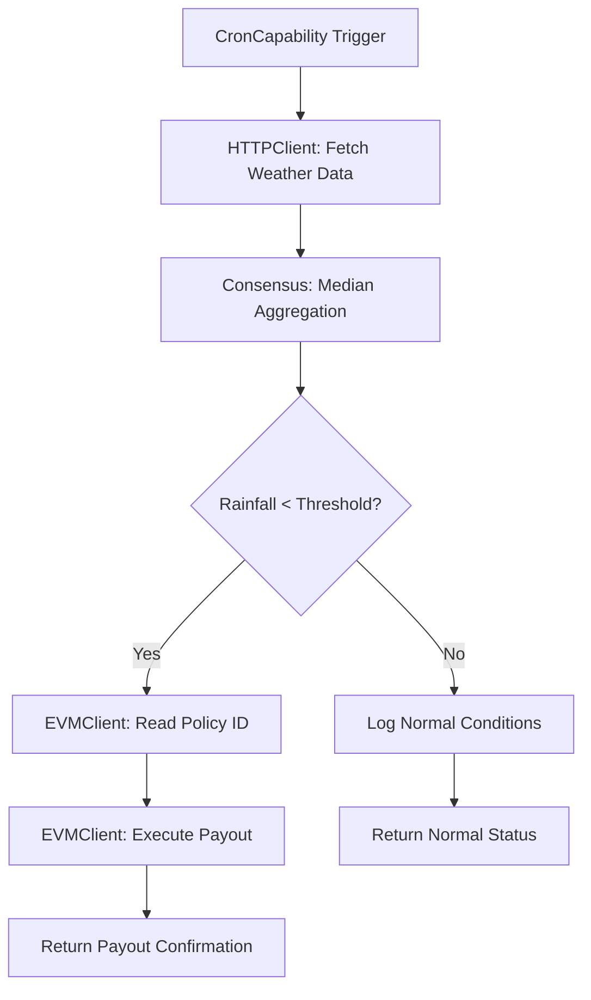

## Overview

CRE capabilities are specialized modules that provide standardized interfaces for common oracle operations. AridGuard leverages three core capabilities:

- **CronCapability**: Time-based workflow triggers
- **HTTPClient**: External API data fetching with consensus
- **EVMClient**: Smart contract read and write operations

## CronCapability

Schedules automated workflow execution at specified intervals.

### Initialization

```typescript
const cron = new cre.capabilities.CronCapability();
return [cre.handler(cron.trigger({ schedule: config.schedule }), onCronTrigger)];
```

### Configuration

<ParamField path="schedule" type="string" required>
  Cron expression defining execution frequency.
  
  **Examples**:
  - `"* * * * *"` - Every minute
  - `"0 * * * *"` - Every hour
  - `"0 0 * * *"` - Daily at midnight
  - `"*/15 * * * *"` - Every 15 minutes
</ParamField>

### Use Cases

- Periodic weather data checks
- Scheduled policy evaluations
- Regular blockchain state synchronization
- Time-based alert triggers

<Info>
  CronCapability is the entry point for the entire workflow. All subsequent operations execute within the handler function.
</Info>

## HTTPClient

Fetches data from external APIs with built-in consensus aggregation across oracle nodes.

### Initialization

```typescript
const httpCapability = new cre.capabilities.HTTPClient();
```

### Consensus Request

```typescript
const medianRainfall = httpCapability
  .sendRequest(runtime, fetchAndParse, consensusMedianAggregation())(runtime.config, apiKey)
  .result();
```

### Custom Fetcher Function

Define data fetching and parsing logic:

```typescript
const fetchAndParse = (sendRequester: HTTPSendRequester, config: Config, apiKey: string) => {
  const url = config.weatherApiUrl.includes("?") 
    ? `${config.weatherApiUrl}&appid=${apiKey}` 
    : `${config.weatherApiUrl}?appid=${apiKey}`;

  const response = sendRequester
    .sendRequest({ url: url, method: "GET" })
    .result();

  if (!ok(response)) {
    throw new Error(`HTTP request failed with status: ${response.statusCode}`);
  }

  const externalResp = json(response) as any;
  const rainfall = externalResp.rain ? externalResp.rain["1h"] || 0 : 0;
  return rainfall;
};
```

### Consensus Aggregation

AridGuard uses median aggregation to prevent outliers from affecting results:

```typescript
const medianRainfall = httpCapability
  .sendRequest(runtime, fetchAndParse, consensusMedianAggregation())(runtime.config, apiKey)
  .result();
```

**How it works**:
1. Each oracle node executes `fetchAndParse` independently
2. All nodes submit their individual rainfall readings
3. CRE computes the median value across all submissions
4. The median value is used for threshold comparison

### Error Handling

```typescript
if (!ok(response)) {
  throw new Error(`HTTP request failed with status: ${response.statusCode}`);
}
```

<Warning>
  Always validate HTTP responses before parsing. Failed requests will cause the oracle node to report an error, which may affect consensus.
</Warning>

### Supported HTTP Methods

- **GET**: Fetch data (used for weather API)
- **POST**: Submit data to external services
- **PUT/PATCH**: Update external resources
- **DELETE**: Remove external resources

## EVMClient

Interacts with EVM-compatible blockchains for reading state and executing transactions.

### Initialization

```typescript
const network = getNetwork({
  chainFamily: "evm",
  chainSelectorName: chainName,
  isTestnet: true,
});

if (!network) throw new Error(`Network ${chainName} not found`);

const evmClient = new cre.capabilities.EVMClient(network.chainSelector.selector);
```

### Reading Contract State

Read active policy IDs from the smart contract:

```typescript
const readAbi = [
  { 
    type: "function", 
    name: "activePolicyIds", 
    inputs: [{ type: "uint256", name: "" }], 
    outputs: [{ type: "bytes32", name: "" }], 
    stateMutability: "view" 
  }
] as const;

const readData = encodeFunctionData({
  abi: readAbi,
  functionName: "activePolicyIds",
  args: [0n]
});

runtime.log(`Reading active policies from contract at ${contractAddress}...`);
const contractCall = evmClient.callContract(runtime, {
  call: encodeCallMsg({
    from: zeroAddress,
    to: contractAddress,
    data: readData,
  }),
  blockNumber: LAST_FINALIZED_BLOCK_NUMBER,
}).result();

const policyId = decodeFunctionResult({
  abi: readAbi,
  functionName: "activePolicyIds",
  data: bytesToHex(contractCall.data),
});
```

### Writing to Contracts

Execute payout transaction when drought is detected:

```typescript
const writeAbi = [
  { 
    type: "function", 
    name: "executePayout", 
    inputs: [{ type: "bytes32", name: "policyId" }], 
    outputs: [], 
    stateMutability: "nonpayable" 
  }
] as const;

const writeData = encodeFunctionData({
  abi: writeAbi,
  functionName: "executePayout",
  args: [policyId as `0x${string}`],
});

runtime.report(prepareReportRequest(writeData)).result();
```

### Block Number Constants

<ParamField path="LAST_FINALIZED_BLOCK_NUMBER" type="constant">
  Special constant that instructs EVMClient to read from the most recent finalized block.
  
  **Why use finalized blocks?**
  - Prevents reading from blocks that may be reorged
  - Ensures data consistency across oracle nodes
  - Provides deterministic results for consensus
</ParamField>

### Network Configuration

```typescript
const network = getNetwork({
  chainFamily: "evm",              // Blockchain type
  chainSelectorName: chainName,     // Network identifier
  isTestnet: true,                  // Testnet vs mainnet
});
```

**Supported Networks**:
- Base Sepolia (testnet)
- Ethereum Sepolia (testnet)
- Arbitrum Sepolia (testnet)
- Optimism Sepolia (testnet)
- And other EVM-compatible chains

## Capability Workflow



## Runtime Object

All capabilities receive a `Runtime` object providing:

```typescript
runtime.config          // Access configuration values
runtime.getSecret()     // Retrieve secrets
runtime.log()           // Log messages
runtime.report()        // Submit transaction reports
```

### Logging

```typescript
runtime.log(`Aggregated median rainfall: ${medianRainfall} mm`);
runtime.log(`ALERT: Drought condition detected! Rainfall ${medianRainfall} is below threshold ${runtime.config.thresholdRainfall}.`);
runtime.log(`Found active policy ID: ${policyId}. Executing payout transaction on Base...`);
```

### Reporting Transactions

```typescript
runtime.report(prepareReportRequest(writeData)).result();
```

<Info>
  The `report` method submits transaction data to the oracle network for consensus and on-chain execution. Only state-changing operations require reporting.
</Info>

## Best Practices

<AccordionGroup>
  <Accordion title="Error Handling">
    Always validate responses and handle errors gracefully. Failed oracle nodes should not crash the entire consensus.
    
    ```typescript
    if (!ok(response)) {
      throw new Error(`HTTP request failed with status: ${response.statusCode}`);
    }
    ```
  </Accordion>
  
  <Accordion title="Deterministic Execution">
    Ensure all oracle nodes produce identical results given the same inputs. Avoid non-deterministic operations like random number generation or timestamps.
  </Accordion>
  
  <Accordion title="Gas Optimization">
    Minimize on-chain operations. Read state efficiently and batch writes when possible.
  </Accordion>
  
  <Accordion title="Security">
    Never expose API keys or private keys in code. Use the runtime secrets manager for sensitive data.
    
    ```typescript
    const secretResponse = runtime.getSecret({ id: "OPENWEATHER_API_KEY" }).result();
    const apiKey = secretResponse.value;
    ```
  </Accordion>
</AccordionGroup>

## Next Steps

<CardGroup cols={2}>
  <Card title="Weather API Integration" icon="cloud" href="/cre/integration/weather-api">
    Learn how to integrate external weather APIs
  </Card>
  <Card title="EVM Client Guide" icon="ethereum" href="/cre/integration/evm-client">
    Deep dive into smart contract interactions
  </Card>
  <Card title="Consensus Methods" icon="users" href="/cre/integration/consensus">
    Understand consensus aggregation strategies
  </Card>
  <Card title="Local Simulation" icon="laptop-code" href="/cre/setup/local-simulation">
    Test capabilities in local environment
  </Card>
</CardGroup>