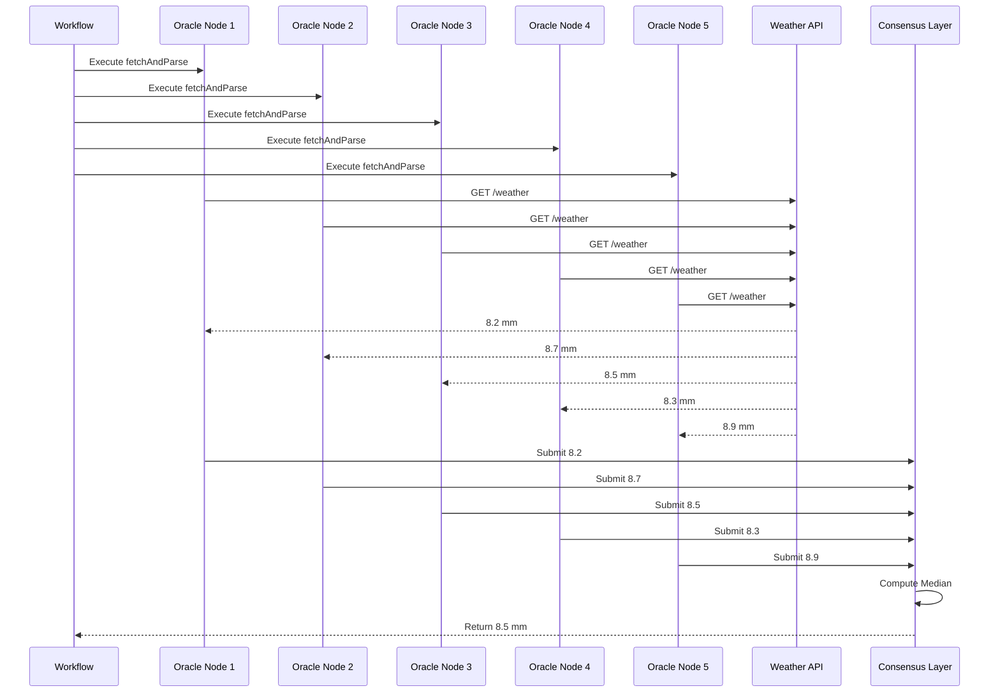

## Overview

Consensus aggregation is a core feature of Chainlink's decentralized oracle network. Multiple independent oracle nodes fetch data and compute an aggregate result, eliminating single points of failure and manipulation.

## How Consensus Works

AridGuard uses median aggregation for rainfall data:

```typescript
const httpCapability = new cre.capabilities.HTTPClient();
const medianRainfall = httpCapability
  .sendRequest(runtime, fetchAndParse, consensusMedianAggregation())(runtime.config, apiKey)
  .result();
```

### Consensus Flow



### Step-by-Step Process

<Steps>
  <Step title="Parallel Execution">
    Each oracle node independently executes the `fetchAndParse` function:
    ```typescript
    const fetchAndParse = (sendRequester: HTTPSendRequester, config: Config, apiKey: string) => {
      const response = sendRequester
        .sendRequest({ url: config.weatherApiUrl, method: "GET" })
        .result();
      const rainfall = externalResp.rain ? externalResp.rain["1h"] || 0 : 0;
      return rainfall;
    };
    ```
  </Step>
  
  <Step title="Data Collection">
    All nodes submit their individual rainfall readings to the consensus layer:
    ```
    Node 1: 8.2 mm
    Node 2: 8.7 mm
    Node 3: 8.5 mm
    Node 4: 8.3 mm
    Node 5: 8.9 mm
    ```
  </Step>
  
  <Step title="Median Calculation">
    CRE computes the median of all submitted values:
    ```
    Sorted: [8.2, 8.3, 8.5, 8.7, 8.9]
    Median: 8.5 mm (middle value)
    ```
  </Step>
  
  <Step title="Result Distribution">
    The median value is returned to the workflow:
    ```typescript
    runtime.log(`Aggregated median rainfall: ${medianRainfall} mm`);
    ```
  </Step>
</Steps>

## Consensus Aggregation Methods

CRE SDK provides multiple aggregation strategies:

### Median Aggregation

Used by AridGuard. Returns the middle value:

```typescript
import { consensusMedianAggregation } from "@chainlink/cre-sdk";

const medianRainfall = httpCapability
  .sendRequest(runtime, fetchAndParse, consensusMedianAggregation())(runtime.config, apiKey)
  .result();
```

**Advantages**:
- Robust against outliers
- Not affected by extreme values
- Good for numeric data with potential anomalies

**Example**:
```
Values: [1, 8, 8.5, 9, 100]
Median: 8.5 (ignores the outlier 100)
```

### Mean Aggregation

Computes the average of all values:

```typescript
import { consensusMeanAggregation } from "@chainlink/cre-sdk";

const meanRainfall = httpCapability
  .sendRequest(runtime, fetchAndParse, consensusMeanAggregation())(runtime.config, apiKey)
  .result();
```

**Advantages**:
- Uses all data points
- Good for normally distributed data

**Disadvantages**:
- Sensitive to outliers

**Example**:
```
Values: [1, 8, 8.5, 9, 100]
Mean: 25.3 (heavily influenced by outlier 100)
```

### Mode Aggregation

Returns the most frequently occurring value:

```typescript
import { consensusModeAggregation } from "@chainlink/cre-sdk";

const modeRainfall = httpCapability
  .sendRequest(runtime, fetchAndParse, consensusModeAggregation())(runtime.config, apiKey)
  .result();
```

**Use cases**:
- Categorical data
- When majority consensus is important

## Why Median for Weather Data?

Median aggregation is ideal for AridGuard because:

1. **Outlier Protection**: A single node receiving corrupted data won't affect the result
2. **API Inconsistencies**: Different nodes may query the API at slightly different times
3. **Network Issues**: Temporary network problems won't skew the aggregate
4. **Byzantine Fault Tolerance**: Even if some nodes are malicious, the median remains accurate

### Example Scenario

```typescript
// Normal case: All nodes get similar readings
Node readings: [8.2, 8.3, 8.5, 8.7, 8.9]
Median: 8.5 mm ✓

// Outlier case: One node gets corrupted data
Node readings: [8.2, 8.3, 8.5, 8.7, 100.0]
Median: 8.5 mm ✓ (outlier ignored)

// With mean aggregation (NOT recommended):
Node readings: [8.2, 8.3, 8.5, 8.7, 100.0]
Mean: 26.74 mm ✗ (outlier causes false drought detection)
```

## Consensus Configuration

### Number of Oracle Nodes

More nodes provide better security but increase costs:

<Tabs>
  <Tab title="3 Nodes (Minimum)">
    Provides basic consensus with 1 outlier tolerance.
    
    ```
    Readings: [8.0, 8.5, 9.0]
    Median: 8.5
    ```
    
    **Cost**: Lower
    **Security**: Basic
  </Tab>
  
  <Tab title="5 Nodes (Recommended)">
    Provides strong consensus with 2 outlier tolerance.
    
    ```
    Readings: [8.0, 8.2, 8.5, 8.7, 9.0]
    Median: 8.5
    ```
    
    **Cost**: Moderate
    **Security**: Strong
  </Tab>
  
  <Tab title="7+ Nodes (High Security)">
    Maximum security for high-value applications.
    
    ```
    Readings: [8.0, 8.1, 8.2, 8.5, 8.6, 8.7, 9.0]
    Median: 8.5
    ```
    
    **Cost**: Higher
    **Security**: Maximum
  </Tab>
</Tabs>

### Consensus Threshold

Minimum number of successful responses required:

```typescript
const medianRainfall = httpCapability
  .sendRequest(
    runtime, 
    fetchAndParse, 
    consensusMedianAggregation({ minResponses: 3 })
  )(runtime.config, apiKey)
  .result();
```

<ParamField path="minResponses" type="number" default="majority">
  Minimum successful node responses required for consensus.
  
  - **3**: At least 3 nodes must respond
  - **5**: At least 5 nodes must respond
  - **"majority"**: More than 50% of nodes
</ParamField>

## Handling Consensus Failures

If consensus cannot be reached, the workflow should handle the error:

```typescript
try {
  const medianRainfall = httpCapability
    .sendRequest(runtime, fetchAndParse, consensusMedianAggregation())(runtime.config, apiKey)
    .result();
    
  runtime.log(`Aggregated median rainfall: ${medianRainfall} mm`);
} catch (error) {
  runtime.log(`Consensus failed: ${error.message}`);
  
  // Fallback strategy:
  // 1. Use previous reading
  // 2. Skip this execution
  // 3. Alert operators
  
  return "Consensus failed, no action taken";
}
```

## Testing Consensus

### Local Simulation

Simulate multiple oracle nodes locally:

```bash
chainlink cre local simulate --nodes 5
```

Output shows each node's reading:
```
[Node 1] Rainfall: 8.2 mm
[Node 2] Rainfall: 8.7 mm
[Node 3] Rainfall: 8.5 mm
[Node 4] Rainfall: 8.3 mm
[Node 5] Rainfall: 8.9 mm
[Consensus] Median rainfall: 8.5 mm
```

### Test Outlier Scenarios

Manually inject outliers for testing:

```typescript
const fetchAndParse = (sendRequester: HTTPSendRequester, config: Config, apiKey: string) => {
  const response = sendRequester
    .sendRequest({ url: config.weatherApiUrl, method: "GET" })
    .result();
    
  const rainfall = externalResp.rain ? externalResp.rain["1h"] || 0 : 0;
  
  // Testing: Inject outlier for node 3
  if (process.env.NODE_ID === '3' && process.env.NODE_ENV === 'test') {
    return 100.0; // Outlier
  }
  
  return rainfall;
};
```

## Consensus on Blockchain

After consensus is reached for weather data, the workflow may trigger on-chain transactions. These also require consensus:

```typescript
const writeData = encodeFunctionData({
  abi: writeAbi,
  functionName: "executePayout",
  args: [policyId as `0x${string}`],
});

runtime.report(prepareReportRequest(writeData)).result();
```

### Transaction Consensus

1. **Data Consensus**: Oracle nodes agree on median rainfall
2. **Action Consensus**: Nodes agree that rainfall < threshold
3. **Transaction Consensus**: Nodes agree to submit payout transaction
4. **On-Chain Execution**: Multi-sig or threshold signature submits transaction

## Best Practices

<AccordionGroup>
  <Accordion title="Choose Appropriate Aggregation">
    Use median for numeric data with potential outliers. Use mode for categorical data. Avoid mean for untrusted data sources.
  </Accordion>
  
  <Accordion title="Set Minimum Responses">
    Require at least 3 nodes for consensus. More nodes provide better security but increase costs.
    
    ```typescript
    consensusMedianAggregation({ minResponses: 3 })
    ```
  </Accordion>
  
  <Accordion title="Handle Failures Gracefully">
    Always wrap consensus calls in try-catch and provide fallback behavior.
    
    ```typescript
    try {
      const result = httpCapability.sendRequest(...);
    } catch (error) {
      runtime.log(`Consensus failed: ${error}`);
      return "No action taken";
    }
    ```
  </Accordion>
  
  <Accordion title="Monitor Consensus Health">
    Track consensus success rate and node participation. Alert if consensus frequently fails or if certain nodes consistently deviate.
  </Accordion>
</AccordionGroup>

## Consensus Security

### Byzantine Fault Tolerance

Median aggregation provides Byzantine fault tolerance up to `(n-1)/2` malicious nodes:

- **5 nodes**: Tolerates 2 Byzantine nodes
- **7 nodes**: Tolerates 3 Byzantine nodes
- **9 nodes**: Tolerates 4 Byzantine nodes

### Sybil Attack Protection

Chainlink's network prevents Sybil attacks through:

1. **Node Reputation**: Nodes earn reputation over time
2. **Economic Stakes**: Nodes stake collateral that can be slashed
3. **Node Selection**: Workflow deployers choose trusted node sets

### Data Integrity

Each node's submission is cryptographically signed, preventing:

- **Data tampering**: Cannot modify another node's submission
- **Replay attacks**: Each submission has a unique nonce
- **Impersonation**: Nodes cannot submit on behalf of others

## Monitoring Consensus

### View Node Submissions

Check individual node responses:

```bash
chainlink cre workflow execution --id <execution_id> --show-nodes
```

Output:
```
Execution ID: abc123...
Timestamp: 2026-03-09 10:00:00 UTC

Node Submissions:
  Node 1: 8.2 mm
  Node 2: 8.7 mm
  Node 3: 8.5 mm
  Node 4: 8.3 mm
  Node 5: 8.9 mm

Consensus Result: 8.5 mm (median)
```

### Alert on Anomalies

Set up alerts for consensus issues:

- **High deviation**: Nodes submitting vastly different values
- **Node failures**: Nodes not responding
- **Consensus timeouts**: Taking too long to reach consensus

## Next Steps

<CardGroup cols={2}>
  <Card title="EVM Integration" icon="ethereum" href="/cre/integration/evm-client">
    Learn about on-chain consensus for transactions
  </Card>
  <Card title="Weather API" icon="cloud" href="/cre/integration/weather-api">
    Understand data fetching for consensus
  </Card>
  <Card title="Deployment" icon="rocket" href="/cre/setup/deployment">
    Deploy workflow with consensus configuration
  </Card>
  <Card title="Capabilities" icon="puzzle-piece" href="/cre/capabilities">
    Explore other CRE capabilities
  </Card>
</CardGroup>