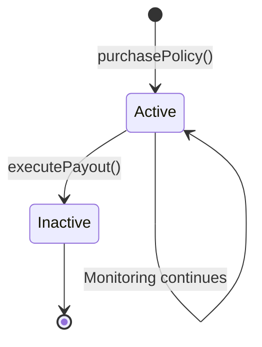

## How Payouts Work

When drought conditions are detected, AridGuard automatically executes payouts through a secure, deterministic smart contract function. The entire process—from detection to funds in wallet—takes just **2-5 seconds**.

<Steps>
  <Step title="Drought Detection">
    CRE workflow identifies rainfall below 10mm threshold
  </Step>
  <Step title="Policy Lookup">
    CRE reads active policy IDs from smart contract
  </Step>
  <Step title="Transaction Submission">
    CRE submits signed `executePayout` transaction to Base
  </Step>
  <Step title="On-Chain Execution">
    Smart contract transfers 10x premium to farmer's wallet
  </Step>
  <Step title="Confirmation">
    Transaction confirmed in ~2 seconds on Base L2
  </Step>
</Steps>

## Smart Contract Payout Function

The `executePayout` function handles all on-chain settlement:

```solidity
function executePayout(bytes32 policyId) external onlyCRE {
    Policy storage policy = policies[policyId];
    require(policy.isActive, "Policy is not active");
    
    // Deactivate policy (prevents double payout)
    policy.isActive = false;
    
    // Calculate payout amount (10x premium)
    uint256 payoutAmount = policy.premiumPaid * 10;
    
    // Ensure contract has sufficient balance
    require(address(this).balance >= payoutAmount, "Insufficient contract balance");
    
    // Transfer funds to farmer
    (bool success, ) = policy.farmer.call{value: payoutAmount}("");
    require(success, "Payout transfer failed");
    
    emit PayoutExecuted(policyId, policy.farmer, payoutAmount);
}
```

### Access Control

Only the authorized CRE address can trigger payouts:

```solidity
address public creAddress; // Set during deployment

modifier onlyCRE() {
    require(msg.sender == creAddress, "Only CRE can execute this");
    _;
}

function executePayout(bytes32 policyId) external onlyCRE {
    // Only CRE workflow can call this function
}
```

This prevents:
- Unauthorized users from triggering payouts
- Malicious actors from draining the contract
- Front-running attacks
- Replay attacks

<Note>
  The `creAddress` is set during contract deployment and can only be updated by the contract owner. This address must match the CRE workflow's signing address.
</Note>

### Reentrancy Protection

The function follows the **Checks-Effects-Interactions** pattern:

```solidity
// 1. CHECKS - Validate conditions
require(policy.isActive, "Policy is not active");
require(address(this).balance >= payoutAmount, "Insufficient balance");

// 2. EFFECTS - Update state
policy.isActive = false; // State change BEFORE external call

// 3. INTERACTIONS - External calls
(bool success, ) = policy.farmer.call{value: payoutAmount}("");
require(success, "Payout transfer failed");
```

By setting `isActive = false` **before** the external call, we prevent reentrancy attacks where a malicious contract could recursively call `executePayout` to drain funds.

<Accordion title="Why not use ReentrancyGuard?">
  While OpenZeppelin's `ReentrancyGuard` is a common pattern, AridGuard achieves the same security by:
  
  1. Deactivating policies before transfers
  2. Using the `onlyCRE` modifier to limit callers
  3. Requiring policies to be active
  
  The combination makes reentrancy impossible without adding extra gas costs.
</Accordion>

## Payout Calculation

### Fixed Multiplier Model

AridGuard uses a simple **10x multiplier**:

```solidity
uint256 payoutAmount = policy.premiumPaid * 10;
```

**Examples:**

| Premium Paid | Payout Amount | ROI |
|-------------|---------------|-----|
| 0.0001 ETH  | 0.001 ETH     | 10x |
| 0.001 ETH   | 0.01 ETH      | 10x |
| 0.01 ETH    | 0.1 ETH       | 10x |

<Tip>
  The 10x multiplier is hardcoded for simplicity. Production systems could use dynamic multipliers based on risk assessment, coverage period, or historical drought frequency.
</Tip>

### Alternative Models

Production implementations could use:

<Accordion title="Variable Multipliers by Risk">
  ```solidity
  mapping(bytes32 => uint256) public policyMultipliers;
  
  function purchasePolicy(int256 lat, int256 long, uint256 multiplier) external payable {
      // Higher risk regions = higher multipliers
      require(multiplier >= 5 && multiplier <= 20, "Invalid multiplier");
      
      bytes32 policyId = keccak256(abi.encodePacked(msg.sender, lat, long, block.timestamp));
      policyMultipliers[policyId] = multiplier;
      // ... rest of function
  }
  
  function executePayout(bytes32 policyId) external onlyCRE {
      uint256 multiplier = policyMultipliers[policyId];
      uint256 payoutAmount = policy.premiumPaid * multiplier;
      // ... rest of function
  }
  ```
</Accordion>

<Accordion title="Tiered Payouts by Severity">
  ```solidity
  function executePayout(bytes32 policyId, uint256 rainfallMm) external onlyCRE {
      Policy storage policy = policies[policyId];
      require(policy.isActive, "Policy is not active");
      
      uint256 multiplier;
      if (rainfallMm < 5) {
          multiplier = 15; // Severe drought
      } else if (rainfallMm < 10) {
          multiplier = 10; // Moderate drought
      } else if (rainfallMm < 15) {
          multiplier = 5;  // Mild drought
      } else {
          revert("No payout condition met");
      }
      
      uint256 payoutAmount = policy.premiumPaid * multiplier;
      // ... rest of function
  }
  ```
</Accordion>

<Accordion title="Time-Based Degradation">
  ```solidity
  struct Policy {
      address farmer;
      int256 lat;
      int256 long;
      uint256 premiumPaid;
      uint256 purchaseTime;
      uint256 expirationTime;
      bool isActive;
  }
  
  function executePayout(bytes32 policyId) external onlyCRE {
      Policy storage policy = policies[policyId];
      require(policy.isActive, "Policy is not active");
      require(block.timestamp <= policy.expirationTime, "Policy expired");
      
      // Payout decreases over time
      uint256 timeRemaining = policy.expirationTime - block.timestamp;
      uint256 totalDuration = policy.expirationTime - policy.purchaseTime;
      uint256 multiplier = 10 * timeRemaining / totalDuration; // 10x to 0x
      
      uint256 payoutAmount = policy.premiumPaid * multiplier;
      // ... rest of function
  }
  ```
</Accordion>

## CRE Payout Execution

The CRE workflow triggers payouts by submitting a transaction:

```typescript
// Define executePayout ABI
const writeAbi = [{
  type: "function",
  name: "executePayout",
  inputs: [{ type: "bytes32", name: "policyId" }],
  outputs: [],
  stateMutability: "nonpayable"
}] as const;

// Encode function call
const writeData = encodeFunctionData({
  abi: writeAbi,
  functionName: "executePayout",
  args: [policyId as `0x${string}`],
});

// Submit transaction via report
runtime.report(prepareReportRequest(writeData)).result();

runtime.log(`Payout executed for policy ${policyId}`);
```

### Transaction Signing

The CRE uses its configured private key to sign transactions:

**Environment Configuration:**

```bash
# .env file in cre/ directory
CRE_ETH_PRIVATE_KEY="your_private_key_here"
```

**Important:** This private key's address must be set as the `creAddress` in the smart contract.

```solidity
// During deployment
constructor(address _creAddress) Ownable(msg.sender) {
    creAddress = _creAddress; // Must match CRE's signing address
}
```

<Warning>
  **Security Best Practice**: Use a dedicated wallet for CRE operations. Never reuse keys from personal wallets or other applications.
</Warning>

### Gas Management

Base Sepolia (and Base mainnet) have very low gas fees:

```typescript
// Typical executePayout transaction
{
  gasUsed: ~50,000 units
  gasPrice: ~0.001 gwei (Base L2)
  cost: ~$0.0001 USD
}
```

For production:

```typescript
// Implement gas price monitoring
const gasPrice = await provider.getGasPrice();
const maxGasPrice = parseUnits("10", "gwei");

if (gasPrice > maxGasPrice) {
  runtime.log("Gas price too high, waiting...");
  return; // Skip this execution, try next cron cycle
}

// Proceed with transaction...
```

## Contract Funding

The contract must have sufficient balance to cover payouts:

```solidity
// Anyone can deposit funds to contract
receive() external payable {}

// Payout checks balance
function executePayout(bytes32 policyId) external onlyCRE {
    // ...
    require(address(this).balance >= payoutAmount, "Insufficient contract balance");
    // ...
}
```

### Funding Strategies

<CardGroup cols={2}>
  <Card title="Premium Pool" icon="piggy-bank">
    Use collected premiums to fund payouts
    
    Pros: Self-sustaining, no external capital needed
    
    Cons: Requires initial funding, risk pool may be insufficient
  </Card>
  <Card title="Reserve Fund" icon="vault">
    Maintain a reserve balance separate from premiums
    
    Pros: Guaranteed payout capacity, professional risk management
    
    Cons: Requires significant capital, opportunity cost
  </Card>
  <Card title="Reinsurance" icon="building-columns">
    Purchase reinsurance for large-scale events
    
    Pros: Limits downside risk, enables larger policies
    
    Cons: Additional costs, counterparty risk
  </Card>
  <Card title="DeFi Yield" icon="chart-line">
    Invest idle capital in yield-generating protocols
    
    Pros: Generate returns on reserves, offset operational costs
    
    Cons: Smart contract risk, market volatility
  </Card>
</CardGroup>

### Example: Premium Pool Model

```solidity
contract AridGuard is Ownable {
    uint256 public totalPremiumsCollected;
    uint256 public totalPayoutsExecuted;
    uint256 public reserveBalance;
    
    function purchasePolicy(int256 lat, int256 long) external payable {
        require(msg.value > 0, "Premium must be greater than 0");
        
        // Track premiums
        totalPremiumsCollected += msg.value;
        
        // Allocate to reserve (e.g., 50%)
        reserveBalance += msg.value / 2;
        
        // Create policy...
    }
    
    function executePayout(bytes32 policyId) external onlyCRE {
        Policy storage policy = policies[policyId];
        require(policy.isActive, "Policy is not active");
        
        policy.isActive = false;
        uint256 payoutAmount = policy.premiumPaid * 10;
        
        // Check both total balance and reserve
        require(address(this).balance >= payoutAmount, "Insufficient total balance");
        require(reserveBalance >= payoutAmount, "Insufficient reserve");
        
        // Deduct from reserve
        reserveBalance -= payoutAmount;
        totalPayoutsExecuted += payoutAmount;
        
        (bool success, ) = policy.farmer.call{value: payoutAmount}("");
        require(success, "Payout transfer failed");
        
        emit PayoutExecuted(policyId, policy.farmer, payoutAmount);
    }
    
    // View solvency ratio
    function getSolvencyRatio() external view returns (uint256) {
        if (totalPremiumsCollected == 0) return 0;
        return (reserveBalance * 100) / (totalPremiumsCollected - totalPayoutsExecuted);
    }
}
```

## Event Emission

Payouts emit detailed events for off-chain tracking:

```solidity
event PayoutExecuted(
    bytes32 indexed policyId,
    address indexed farmer,
    uint256 payoutAmount
);

// Emitted at end of executePayout
emit PayoutExecuted(policyId, policy.farmer, payoutAmount);
```

### Event Indexing

Frontends can listen for payout events:

```typescript
import { useWatchContractEvent } from 'wagmi';

function PayoutMonitor() {
  useWatchContractEvent({
    address: ARIDGUARD_ADDRESS,
    abi: ARIDGUARD_ABI,
    eventName: 'PayoutExecuted',
    onLogs(logs) {
      logs.forEach(log => {
        console.log('Payout executed!');
        console.log('Policy ID:', log.args.policyId);
        console.log('Farmer:', log.args.farmer);
        console.log('Amount:', log.args.payoutAmount);
        
        // Show notification to user
        showNotification(`Payout of ${formatEther(log.args.payoutAmount)} ETH sent to ${log.args.farmer}`);
      });
    }
  });
}
```

### Historical Queries

Query past payouts using event filters:

```typescript
import { createPublicClient, http } from 'viem';
import { baseSepolia } from 'viem/chains';

const client = createPublicClient({
  chain: baseSepolia,
  transport: http()
});

// Get all payouts for a specific farmer
const logs = await client.getLogs({
  address: ARIDGUARD_ADDRESS,
  event: parseAbiItem('event PayoutExecuted(bytes32 indexed policyId, address indexed farmer, uint256 payoutAmount)'),
  args: {
    farmer: '0x...' // Filter by farmer address
  },
  fromBlock: 0n,
  toBlock: 'latest'
});

console.log(`Found ${logs.length} payouts for this farmer`);
```

## Policy Deactivation

Once a payout executes, the policy becomes inactive:

```solidity
policy.isActive = false; // Prevents double payout
```

Inactive policies cannot receive additional payouts:

```solidity
function executePayout(bytes32 policyId) external onlyCRE {
    Policy storage policy = policies[policyId];
    require(policy.isActive, "Policy is not active"); // Will revert for inactive policies
    // ...
}
```

### Policy Lifecycle



**States:**

1. **Non-existent**: Policy not yet created
2. **Active**: Policy purchased, monitoring in progress
3. **Inactive**: Payout executed, policy terminated

There is **no way to reactivate** a policy after payout. Farmers must purchase a new policy for continued coverage.

<Tip>
  Production systems could implement policy renewal mechanisms where farmers can extend coverage before expiration.
</Tip>

## Error Handling

The contract includes multiple safety checks:

```solidity
function executePayout(bytes32 policyId) external onlyCRE {
    Policy storage policy = policies[policyId];
    
    // Error 1: Only CRE can call
    // Reverts with: "Only CRE can execute this"
    
    // Error 2: Policy must exist and be active
    require(policy.isActive, "Policy is not active");
    
    policy.isActive = false;
    uint256 payoutAmount = policy.premiumPaid * 10;
    
    // Error 3: Contract must have funds
    require(address(this).balance >= payoutAmount, "Insufficient contract balance");
    
    // Error 4: Transfer must succeed
    (bool success, ) = policy.farmer.call{value: payoutAmount}("");
    require(success, "Payout transfer failed");
    
    emit PayoutExecuted(policyId, policy.farmer, payoutAmount);
}
```

**Possible Failure Scenarios:**

<Accordion title="Unauthorized caller">
  **Cause**: Non-CRE address attempts to call `executePayout`
  
  **Error**: `"Only CRE can execute this"`
  
  **Resolution**: Ensure CRE address is correctly configured
</Accordion>

<Accordion title="Inactive policy">
  **Cause**: Policy already paid out or never existed
  
  **Error**: `"Policy is not active"`
  
  **Resolution**: Verify policy ID and status before execution
</Accordion>

<Accordion title="Insufficient balance">
  **Cause**: Contract lacks funds to cover payout
  
  **Error**: `"Insufficient contract balance"`
  
  **Resolution**: Fund contract or adjust payout amounts
</Accordion>

<Accordion title="Transfer failure">
  **Cause**: Recipient is contract that rejects ETH, or gas limit exceeded
  
  **Error**: `"Payout transfer failed"`
  
  **Resolution**: Investigate recipient address, increase gas limit
</Accordion>

## Speed Comparison

### Traditional Insurance Timeline

```
Day 0:  Drought occurs
Day 1:  Farmer notices crop damage
Day 2:  Farmer files claim with insurance company
Day 5:  Claim acknowledged, inspector scheduled
Day 12: Inspector visits farm, documents damage
Day 20: Farmer submits additional documentation
Day 30: Insurance reviews claim
Day 35: Settlement offer made
Day 40: Farmer accepts/negotiates
Day 45: Payment processing initiated
Day 50: Funds arrive in farmer's bank account

Total: 50 days (7+ weeks)
```

### AridGuard Timeline

```
00:00:00  Drought condition met (rainfall < 10mm)
00:00:01  CRE detects threshold violation
00:00:02  CRE reads active policy from contract
00:00:03  CRE submits executePayout transaction
00:00:05  Transaction confirmed on Base
00:00:05  Funds in farmer's wallet

Total: 5 seconds
```

**Speed Advantage: 864,000x faster** ⚡

<Note>
  Instant payouts provide farmers with immediate liquidity to:
  - Purchase emergency supplies
  - Invest in alternative crops
  - Cover operational expenses
  - Avoid predatory lending
</Note>

## Next Steps

<CardGroup cols={2}>
  <Card
    title="Integration Guide"
    icon="code"
    href="/integration/policy-purchase"
  >
    Build interfaces to purchase policies
  </Card>
  <Card
    title="Smart Contract API"
    icon="file-contract"
    href="/architecture/smart-contracts"
  >
    Complete contract reference
  </Card>
  <Card
    title="Monitoring Policies"
    icon="chart-line"
    href="/integration/monitoring-policies"
  >
    Track policy status and events
  </Card>
  <Card
    title="CRE Workflow"
    icon="arrows-spin"
    href="/architecture/cre-workflow"
  >
    How CRE triggers payouts
  </Card>
</CardGroup>