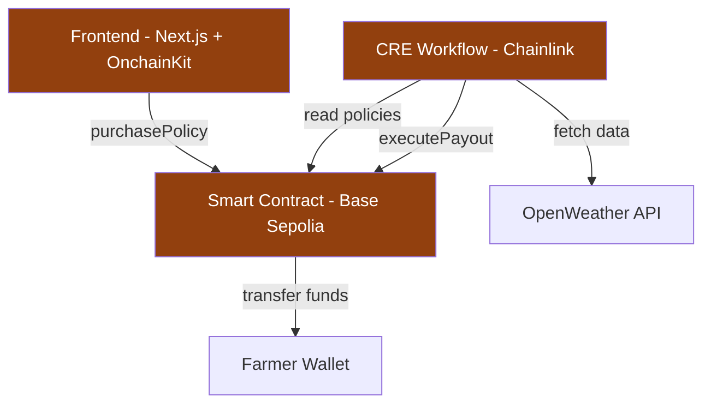

## The Parametric Insurance Model

AridGuard implements **parametric insurance**, a revolutionary approach that differs fundamentally from traditional indemnity insurance.

<CardGroup cols={2}>
  <Card title="Traditional Insurance" icon="file-lines">
    - Manual damage assessments
    - Subjective loss evaluations
    - Weeks/months for claims processing
    - High administrative overhead
    - Prone to disputes
  </Card>
  <Card title="Parametric Insurance" icon="bolt">
    - Automated trigger monitoring
    - Objective data measurements
    - Instant automated payouts
    - Minimal operational costs
    - Zero disputes (transparent triggers)
  </Card>
</CardGroup>

### How Traditional Insurance Works

When a farmer files a claim:

<Steps>
  <Step title="Report Loss">
    Farmer notices crop damage and files a claim with insurance company
  </Step>
  <Step title="Site Inspection">
    Loss adjuster visits farm to assess damage (days/weeks later)
  </Step>
  <Step title="Documentation">
    Farmer provides receipts, photos, and detailed loss documentation
  </Step>
  <Step title="Review Process">
    Insurance company reviews claim, often requesting additional info
  </Step>
  <Step title="Negotiation">
    Settlement amount negotiated, potentially disputed
  </Step>
  <Step title="Payout">
    After 4-12 weeks, farmer receives payment (maybe)
  </Step>
</Steps>

**Problems:**
- Slow: Farmers need immediate cash after disasters
- Expensive: Administrative costs increase premiums
- Subjective: Disputes over damage assessments are common
- Inaccessible: Small farmers often excluded due to high costs

### How AridGuard Works

Parametric insurance eliminates all manual steps:

<Steps>
  <Step title="Purchase Policy">
    Farmer purchases policy with predefined trigger (< 10mm rainfall)
  </Step>
  <Step title="Automated Monitoring">
    Chainlink CRE continuously monitors weather conditions
  </Step>
  <Step title="Trigger Detected">
    When rainfall drops below 10mm, trigger activates automatically
  </Step>
  <Step title="Instant Payout">
    Smart contract immediately transfers funds to farmer's wallet
  </Step>
</Steps>

**Benefits:**
- Fast: Payouts in seconds, not weeks
- Cheap: No loss adjusters or claim processors
- Objective: Trigger is based on verifiable weather data
- Accessible: Low overhead enables coverage for small farms

<Note>
  The payout is triggered by the **parametric condition** (rainfall measurement), not by actual crop damage. This eliminates the need for damage assessment entirely.
</Note>

## The AridGuard Architecture

AridGuard consists of three interconnected layers:



### Layer 1: Frontend Application

The web interface enables farmers to:
- Connect their wallet using Coinbase OnchainKit
- View policy details and coverage terms
- Purchase insurance policies
- Monitor policy status

**Technology Stack:**
- Next.js 14 (React framework)
- Coinbase OnchainKit (wallet integration)
- Wagmi & Viem (contract interactions)
- TailwindCSS (styling)

### Layer 2: Smart Contracts

The on-chain settlement layer manages:
- Policy registration and premium collection
- Policy state (active/inactive)
- Payout execution (10x premium)
- Access control (only CRE can trigger payouts)

**Key Contract: AridGuard.sol**

```solidity
contract AridGuard is Ownable {
    address public creAddress; // Authorized CRE executor
    
    struct Policy {
        address farmer;      // Policy owner
        int256 lat;          // Latitude (scaled by 100)
        int256 long;         // Longitude (scaled by 100)
        uint256 premiumPaid; // Amount paid
        bool isActive;       // Active status
    }
    
    mapping(bytes32 => Policy) public policies;
    bytes32[] public activePolicyIds;
}
```

Deployed on Base Sepolia: [`0x23d747751abF06b68539f0684abe21E2A76901fc`](https://sepolia.basescan.org/address/0x23d747751abF06b68539f0684abe21E2A76901fc)

### Layer 3: Chainlink CRE Workflow

The off-chain compute layer provides:
- Scheduled monitoring (cron triggers)
- Weather data fetching (HTTP requests)
- Data aggregation (median consensus)
- Condition evaluation (threshold comparison)
- Payout execution (EVM transactions)

**Workflow Configuration:**

```json
{
  "schedule": "* * * * *",
  "weatherApiUrl": "https://api.openweathermap.org/data/2.5/weather?q=Nairobi&units=metric",
  "thresholdRainfall": 10,
  "evm": {
    "chainSelectorName": "ethereum-testnet-sepolia-base-1",
    "contractAddress": "0x23d747751abF06b68539f0684abe21E2A76901fc"
  }
}
```

## Complete Data Flow

Let's trace the complete lifecycle of an insurance policy:

### 1. Policy Purchase

<CodeGroup>
```typescript Frontend
// User clicks "Purchase Policy" button
const handlePurchase = () => {
  writeContract({
    address: ARIDGUARD_ADDRESS,
    abi: ARIDGUARD_ABI,
    functionName: 'purchasePolicy',
    args: [5000, 360000], // Lat: 0.05°, Long: 36.0°
    value: parseEther("0.0001") // 0.0001 ETH premium
  });
};
```

```solidity Smart Contract
function purchasePolicy(int256 lat, int256 long) external payable {
    require(msg.value > 0, "Premium must be greater than 0");
    
    // Generate unique policy ID
    bytes32 policyId = keccak256(
        abi.encodePacked(msg.sender, lat, long, block.timestamp)
    );
    
    // Store policy
    policies[policyId] = Policy({
        farmer: msg.sender,
        lat: lat,
        long: long,
        premiumPaid: msg.value,
        isActive: true
    });
    
    activePolicyIds.push(policyId);
    emit PolicyPurchased(policyId, msg.sender, lat, long, msg.value);
}
```
</CodeGroup>

**Result:** Policy is recorded on-chain, premium is held in contract, policy ID added to active list.

### 2. Continuous Monitoring

The CRE workflow runs on a scheduled basis:

```typescript
// Cron trigger fires every minute
const onCronTrigger = (runtime: Runtime<Config>) => {
  // 1. Fetch API key from secrets
  const secretResponse = runtime.getSecret({ 
    id: "OPENWEATHER_API_KEY" 
  }).result();
  const apiKey = secretResponse.value;
  
  // 2. Fetch weather data using HTTP capability
  const httpCapability = new cre.capabilities.HTTPClient();
  const medianRainfall = httpCapability
    .sendRequest(runtime, fetchAndParse, consensusMedianAggregation())
    (runtime.config, apiKey)
    .result();
  
  runtime.log(`Aggregated median rainfall: ${medianRainfall} mm`);
  
  // 3. Check threshold
  if (medianRainfall < runtime.config.thresholdRainfall) {
    // Drought detected! Execute payout...
  }
};
```

**Result:** Rainfall data is fetched, aggregated, and evaluated every minute.

### 3. Drought Detection

When rainfall drops below the 10mm threshold:

```typescript
if (medianRainfall < runtime.config.thresholdRainfall) {
  runtime.log(`ALERT: Drought condition detected!`);
  runtime.log(`Rainfall ${medianRainfall}mm is below threshold ${runtime.config.thresholdRainfall}mm`);
  
  // Initialize EVM client for Base Sepolia
  const network = getNetwork({
    chainFamily: "evm",
    chainSelectorName: "ethereum-testnet-sepolia-base-1",
    isTestnet: true,
  });
  
  const evmClient = new cre.capabilities.EVMClient(
    network.chainSelector.selector
  );
  
  // Continue to read active policies...
}
```

**Result:** CRE workflow recognizes drought condition and prepares to execute payout.

### 4. Policy Retrieval

The CRE reads active policies from the contract:

```typescript
// Read activePolicyIds[0] from contract
const readAbi = [{
  type: "function",
  name: "activePolicyIds",
  inputs: [{ type: "uint256" }],
  outputs: [{ type: "bytes32" }],
  stateMutability: "view"
}] as const;

const readData = encodeFunctionData({
  abi: readAbi,
  functionName: "activePolicyIds",
  args: [0n] // Get first active policy
});

const contractCall = evmClient.callContract(runtime, {
  call: encodeCallMsg({
    from: zeroAddress,
    to: contractAddress,
    data: readData,
  }),
  blockNumber: LAST_FINALIZED_BLOCK_NUMBER,
}).result();

const policyId = decodeFunctionResult({
  abi: readAbi,
  functionName: "activePolicyIds",
  data: bytesToHex(contractCall.data),
});

runtime.log(`Found active policy ID: ${policyId}`);
```

**Result:** CRE identifies which policies need payouts.

### 5. Payout Execution

The CRE executes the payout transaction:

```typescript
// Encode executePayout call
const writeAbi = [{
  type: "function",
  name: "executePayout",
  inputs: [{ type: "bytes32", name: "policyId" }],
  outputs: [],
  stateMutability: "nonpayable"
}] as const;

const writeData = encodeFunctionData({
  abi: writeAbi,
  functionName: "executePayout",
  args: [policyId as `0x${string}`],
});

// Submit transaction via report
runtime.report(prepareReportRequest(writeData)).result();

return `Payout Executed for rainfall: ${medianRainfall}mm. Policy ID: ${policyId}`;
```

**Result:** Transaction submitted to Base Sepolia to execute payout.

### 6. On-Chain Settlement

The smart contract processes the payout:

```solidity
function executePayout(bytes32 policyId) external onlyCRE {
    Policy storage policy = policies[policyId];
    require(policy.isActive, "Policy is not active");
    
    // Deactivate policy (prevents double-payout)
    policy.isActive = false;
    
    // Calculate payout (10x premium)
    uint256 payoutAmount = policy.premiumPaid * 10;
    require(address(this).balance >= payoutAmount, "Insufficient balance");
    
    // Transfer funds to farmer
    (bool success, ) = policy.farmer.call{value: payoutAmount}("");
    require(success, "Payout transfer failed");
    
    emit PayoutExecuted(policyId, policy.farmer, payoutAmount);
}
```

**Result:** 10x premium (0.001 ETH) transferred to farmer's wallet instantly.

## Security & Trust

### Access Control

Only the authorized CRE address can trigger payouts:

```solidity
address public creAddress; // Set during deployment

modifier onlyCRE() {
    require(msg.sender == creAddress, "Only CRE can execute this");
    _;
}

function executePayout(bytes32 policyId) external onlyCRE {
    // Only CRE can call this
}
```

This prevents:
- Unauthorized payout attempts
- Front-running attacks
- Malicious actor exploits

### Data Integrity

The CRE uses **consensus median aggregation**:

```typescript
const medianRainfall = httpCapability
  .sendRequest(runtime, fetchAndParse, consensusMedianAggregation())
  (runtime.config, apiKey)
  .result();
```

This ensures:
- Multiple data sources are queried
- Median value eliminates outliers
- Single-point failures don't affect payouts
- Data manipulation is extremely difficult

### Immutable Policies

Once created, policy parameters cannot be changed:

```solidity
struct Policy {
    address farmer;      // Fixed at creation
    int256 lat;          // Fixed at creation
    int256 long;         // Fixed at creation
    uint256 premiumPaid; // Fixed at creation
    bool isActive;       // Only changes false on payout
}
```

This guarantees:
- No retroactive changes to terms
- Transparent coverage conditions
- Farmer confidence in payout reliability

## Why It's Revolutionary

<CardGroup cols={2}>
  <Card title="Financial Inclusion" icon="hand-holding-dollar">
    Low overhead costs make insurance accessible to smallholder farmers previously excluded from traditional insurance markets.
  </Card>
  <Card title="Zero Trust Required" icon="shield-halved">
    Smart contracts eliminate counterparty risk. If conditions are met, payout is guaranteed by code, not promises.
  </Card>
  <Card title="Instant Liquidity" icon="money-bill-transfer">
    Farmers receive funds immediately when needed most, right after a disaster, not months later.
  </Card>
  <Card title="Transparent Operations" icon="magnifying-glass">
    All policies, triggers, and payouts are publicly verifiable on-chain. No hidden clauses or surprise denials.
  </Card>
</CardGroup>

## Limitations & Considerations

<Warning>
  Parametric insurance has an important limitation: **basis risk**.
</Warning>

**Basis Risk** is the mismatch between the trigger condition and actual losses:

- Drought detected but specific farm has irrigation → Farmer gets paid without loss
- Local microclimates cause rain to miss farm → Farmer suffers loss without payout

AridGuard addresses this through:
- Precise GPS coordinates for monitoring
- Adjustable threshold configurations
- Multiple data point aggregation

In production systems, basis risk is minimized by:
- Satellite imagery analysis
- Soil moisture sensors
- Multi-parameter triggers (temperature, humidity, wind)

## Next Steps

<CardGroup cols={2}>
  <Card
    title="Explore Features"
    icon="sparkles"
    href="/features/parametric-insurance"
  >
    Learn about AridGuard's key capabilities
  </Card>
  <Card
    title="Architecture Deep Dive"
    icon="diagram-project"
    href="/architecture/overview"
  >
    Understand the technical implementation
  </Card>
</CardGroup>